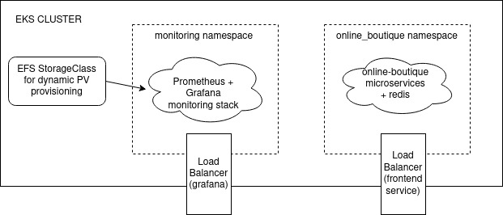

# Overview

* This repository contains kubernetes manifest files and helm charts for deploying **online-boutique** and Prometheus/Grafana stack for monitoring cluster health to AWS EKS cluster
* Helm charts and manifest files from this repository are used by [ansible playbooks](https://github.com/anea-11/infra-config/tree/main/playbooks) to automate cluster configuration and app deployment

# Cluster structure

